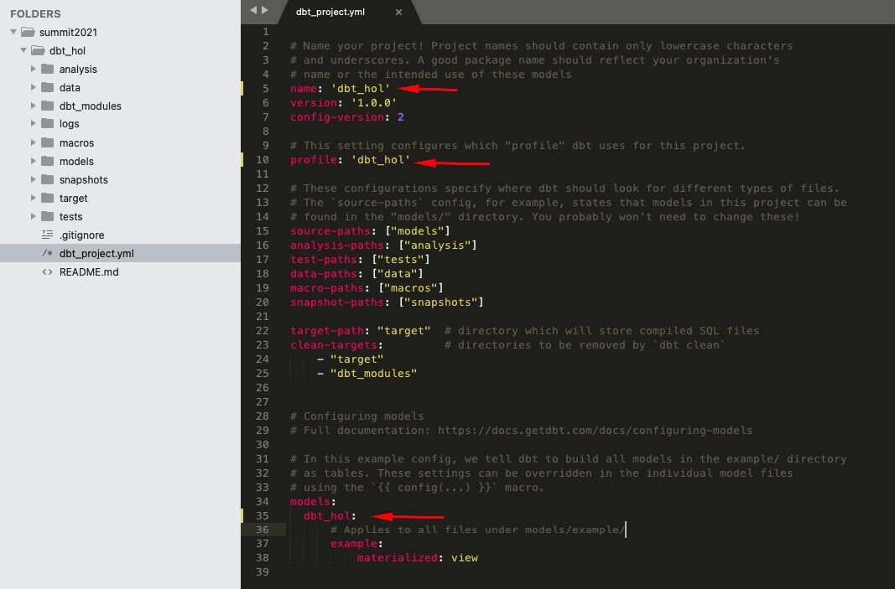

## Initialize dbt project
Create a new dbt project in any local folder by running the following commands:
```shell
dbt init dbt_hol
cd dbt_hol
```

## Configure dbt/Snowflake profiles
### 1. Open `~/.dbt/profiles.yml` in text editor and add the following section
```yml
dbt_hol:
  target: dev
  outputs:
    dev:
      type: snowflake
      ######## Please replace with your Snowflake account name
      account: <your_snowflake_trial_account>
      
      user: dbt_user
      ######## Please replace with your Snowflake dbt user password
      password: <mysecretpassword>
      
      role: dbt_dev_role
      database: dbt_hol_dev
      warehouse: dbt_dev_wh
      schema: public
      threads: 200
    prod:
      type: snowflake
      ######## Please replace with your Snowflake account name
      account: <your_snowflake_trial_account>
      
      user: dbt_user
      ######## Please replace with your Snowflake dbt user password
      password: <mysecretpassword>
      
      role: dbt_prod_role
      database: dbt_hol_prod
      warehouse: dbt_prod_wh
      schema: public
      threads: 200
```
### 2. Open `dbt_project.yml` (in dbt_hol folder) and update the following sections:


### Validate the configuration
Run the following command (in dbt_hol folder):
```shell
dbt debug
```
The expected output should look like this, confirming that dbt was able to access the database:


### Test run
Finally, let's run the sample models that comes with dbt templates by default to validate everything is set up correctly. For this, please run the following command (in dbt_hol folder):
```shell
dbt run
```
The expected output should look like this, confirming dbt was able to connect and successfully run sample models:


You can use Snowflake worksheets to validate that the sample view and the table are now available in DEV database:
