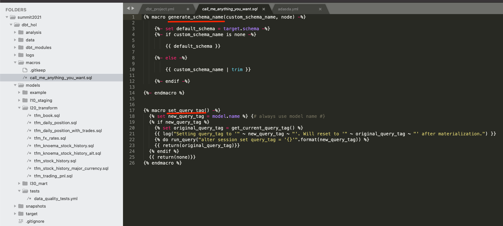

## Configuration
We are going to start by adding few more things to our dbt project configuration in order to improve maintainability. 1.. Model folders/layers. From our dbt project folder location, let's run few command line commands to create separate folders for models, representing different logical levels in the pipeline:
```shell
mkdir models/l10_staging
mkdir models/l20_transform
mkdir models/l30_mart
mkdir models/tests
```

Then let's open our `dbt_profile.yml` and modify the section below to reflect the model structure.
```yml
models:
  dbt_hol:
      # Applies to all files under models/example/
      example:
          materialized: view
          +enabled: false
      l10_staging:
          schema: l10_staging
          materialized: view
      l20_transform:
          schema: l20_transform
          materialized: view
      l30_mart:
          schema: l30_mart
          materialized: view
```


As you can see, this is allowing you to set multiple parameters on the layer level (like materialization in this example). Also, you would notice that we added `+enabled: false` to the `examples` section as we won't need to run those sample models in the final state.

## Custom schema naming macros
By default, dbt is generating a schema name by appending it to the target schema environment name(dev, prod). In this lab we are going to show you a quick way to override this macro, making our schema names to look exactly the same between dev and prod databases. For this, let's create a file `macros\call_me_anything_you_want.sql` with the following content:
```sql

    
    
        {{ default_schema }}
    
        {{ custom_schema_name | trim }}
    




   {# always use model name #}
  
    
    {{ log("Setting query_tag to '" ~ new_query_tag ~ "'. Will reset to '" ~ original_query_tag ~ "' after materialization.") }}
    
    {{ return(original_query_tag)}}
  
  {{ return(none)}}

```


## Query Tag
As you might notice, in the screenshot above there is another macro overridden in the file: `set_query_tag()`. This one provides the ability to add additional level of transparency by automatically setting Snowflake query_tag to the name of the model it associated with.

So if you go in Snowflake UI and click ‘History' icon on top, you are going to see all SQL queries run on Snowflake account(successful, failed, running etc) and clearly see what dbt model this particular query is related to:


## dbt plugins
Last one, we promise! Alongside functionality coming out of the box with dbt core, dbt also provide capability to plug-in additional packages. Those could be published in the [dbt Hub](https://hub.getdbt.com/) or straight out of GitHub repository. In our lab, we are going to demonstrate how to use some automation that [dbt_utils](https://hub.getdbt.com/fishtown-analytics/dbt_utils/latest/) package provides. Let's install it. For that, let's create a file called `packages.yml` in the root of your dbt project folder and add the following lines:
```yml
packages:
  - package: fishtown-analytics/dbt_utils
    version: 0.6.4
```


Once this done, let's open a command line and run
```shell
dbt deps
```

