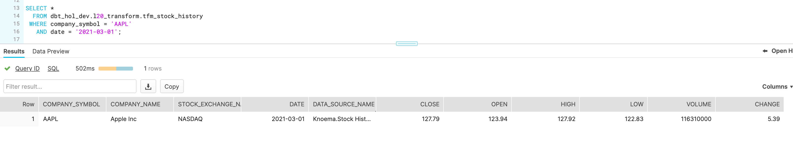

In this guide the dataset `Economy Data Atlas` from the Snowflake Marketplace will be used:


1. We are going to start building our pipelines starts by declaring [dbt sources](https://docs.getdbt.com/docs/building-a-dbt-project/using-sources). For this let's create a `models/l10_staging/sources.yml` file and add the following configuration:
    ```yml
    version: 2

    sources:
    - name: knoema_economy_data_atlas
        database: knoema_economy_data_atlas
        schema: economy
        tables:
        - name: exratescc2018
        - name: usindssp2020
    ```

    As you probably remember, these two objects were mentioned in Knoema Dataset Catalog table: daily exchange rates and daily US trading history accordingly.

2. Base views is the concept of models that act as a first-level transformation. While not mandatory, these could act as a level of abstraction, separating ultimate source structure from the entry point of dbt pipeline. Providing your project more options to react to an upstream structure change. You can read more about arguments on benefits provided by the base view concept [here](https://discourse.getdbt.com/t/how-we-structure-our-dbt-projects/355). We are going to create a fairly simple pass-through pair of base views:

    * `models/l10_staging/base_knoema_fx_rates.sql`
        ```sql
        SELECT "Currency"        currency
            , "Currency Unit"   currency_unit
            , "Frequency"       frequency
            , "Date"            date
            , "Value"           value
            , 'Knoema.FX Rates' data_source_name
            , src.*
        FROM {{source('knoema_economy_data_atlas','exratescc2018')}}  src 
        ```

    * `models/l10_staging/base_knoema_stock_history.sql`
        ```sql
        SELECT "Company"                    Company
            , "Company Name"               Company_Name
            , "Company Symbol"             Company_Symbol
            , "Stock Exchange"             Stock_Exchange
            , "Stock Exchange Name"        Stock_Exchange_Name
            , "Indicator"                  Indicator
            , "Indicator Name"             Indicator_Name
            , "Units"                      Units
            , "Scale"                      Scale
            , "Frequency"                  Frequency
            , "Date"                       Date
            , "Value"                      Value
            , 'Knoema.Stock History' data_source_name
        FROM {{source('knoema_economy_data_atlas','usindssp2020')}}  src
        ```

    As you can see we used the opportunity to change case-sensitive & quoted name of the attributes to case insensitive to improve readability. Also as I am sure you noticed, this looks like SQL with the exception of macro `{{source()}}` that is used in "FROM" part of the query instead of fully qualified path (database.schema.table). This is one of the key concepts that is allowing dbt during compilation to replace this with target-specific name. As result, you as a developer, can promote same pipeline code to DEV, PROD and any other environments without any changes.

    Let's run it. Please notice how versatile `dbt run` parameters are. In this example we are going to run all models that are located in `models/l10_staging`.

    ```shell
    dbt run --model l10_staging 
    ```
    

    Now we can go and query this dataset to take a feel of what the data profile looks like.

    ```sql
    SELECT * 
    FROM dbt_hol_dev.l10_staging.base_knoema_stock_history 
    WHERE Company_Symbol ='AAPL' 
    AND date ='2021-03-01'
    ```
    

    In this dataset, different measures like Close, Open, High and Low price are represented as different rows. For our case this looks is a bit suboptimal - to simplify the use we would rather see that data transposed into columns, towards something like this:

    

    To achieve that, let's create few more models:

    * `models/l20_transform/tfm_knoema_stock_history.sql`

    In this model, we use Snowflake's [PIVOT](https://docs.snowflake.com/en/sql-reference/constructs/pivot.html) function to transpose the dataset from rows to columns

    ```sql
    WITH cst AS
    (
    SELECT company_symbol, company_name, stock_exchange_name, indicator_name, date, value , data_source_name
    FROM {{ref('base_knoema_stock_history')}} src
    WHERE indicator_name IN ('Close', 'Open','High','Low', 'Volume', 'Change %') 
    )
    SELECT * 
    FROM cst
    PIVOT(SUM(Value) for indicator_name IN ('Close', 'Open','High','Low', 'Volume', 'Change %')) 
    AS p(company_symbol, company_name, stock_exchange_name, date, data_source_name, close ,open ,high,low,volume,change)
    ```

    * `models/l20_transform/tfm_knoema_stock_history_alt.sql`

    While this model is more for illustration purposes on how similar could be achieved by leveraging `dbt_utils.pivot`

    ```sql
    SELECT
    company_symbol, company_name, stock_exchange_name, date, data_source_name,
    {{ dbt_utils.pivot(
        column = 'indicator_name',
        values = dbt_utils.get_column_values(ref('base_knoema_stock_history'), 'indicator_name'),
        then_value = 'value'
    ) }}
    FROM {{ ref('base_knoema_stock_history') }}
    GROUP BY company_symbol, company_name, stock_exchange_name, date, data_source_name
    ```

    * `models/l20_transform/tfm_stock_history.sql`

    Finally we are going to create another model that abstracts source-specific transformations into a business view. In case there were multiple feeds providing datasets of the same class (stock history in this case), this view would be able to consolidate (UNION ALL) data from all of them. Thus becoming a one-stop-shop for all stock_history data.

    ```sql
    SELECT src.*
    FROM {{ref('tfm_knoema_stock_history')}} src
    ```

3. Deploy. The hard work is done. Let's go and deploy these. In this case we will automatically deploy tfm_stock_history and all of its ancestors.

    ```shell
    dbt run --model +tfm_stock_history
    ```

    

    Let's we go to Snowflake UI to check the results

    ```sql
    SELECT * 
    FROM dbt_hol_dev.l20_transform.tfm_stock_history
    WHERE company_symbol = 'AAPL'
    AND date = '2021-03-01'
   ```

    

