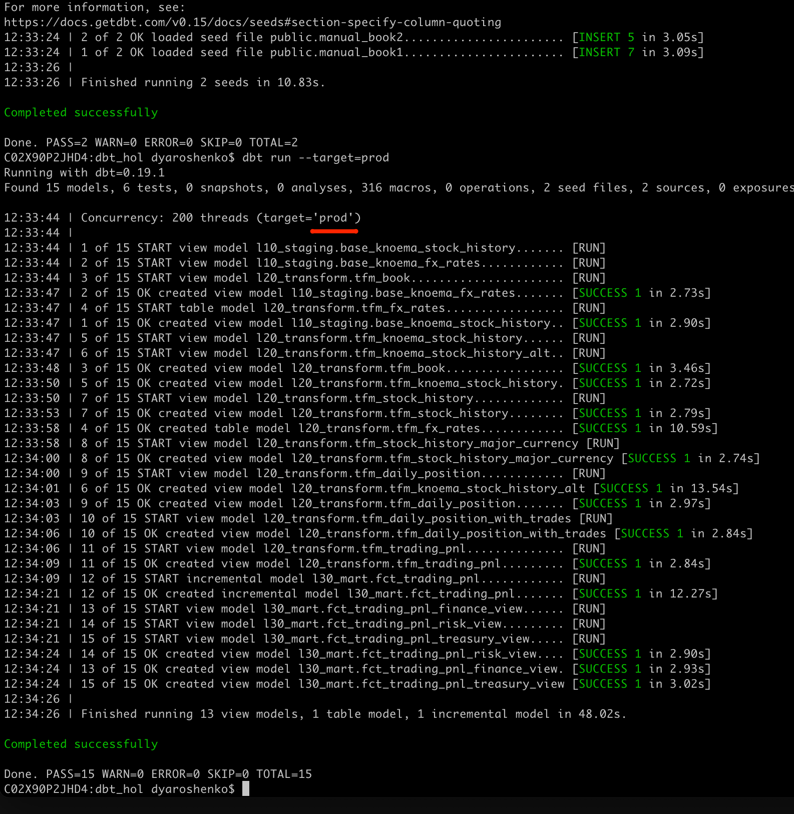

## Establishing Testing
To build trust in your data solution, it is hard to underestimate the importance of testing. While there are many ways to organize automated testing, thankfully dbt tool comes with the great [data tests framework](https://docs.getdbt.com/docs/building-a-dbt-project/tests). Let's build an example.

First, let's add the test configuration file and add the content below. dbt comes with a set of pre-defined data tests, such as uniqueness, not_null, check constraints, ref integrity etc. We are going to set up tests on the few models, however it is highly recommended to establish reasonable test coverage across the board.

* `models/tests/data_quality_tests.yml`

```yml
version: 2

models:
  - name: tfm_fx_rates
    columns:
      - name: currency||date
        tests:
          - unique
          - not_null

  - name: tfm_book
    columns:
      - name: instrument
        tests:
          - not_null
          - relationships:
              to: ref('tfm_stock_history')
              field: company_symbol

  - name: tfm_stock_history
    columns:
      - name: company_symbol||date
        tests:
          - not_null
          - unique
```

Next, let's run these tests:

```shell
dbt test
```

Boom! One of the tests failed! Let's try to understand why. dbt command line is kindly provided a link to the file with the SQL check that failed. Let's open it and copy-paste the content to Snowflake worksheet:


Let's quickly check the full row width for one of the records failed by extending this check towards something like this:

```sql
WITH cst AS
(
    select
        company_symbol||date conctat

    from dbt_hol_dev.l20_transform.tfm_stock_history
    where company_symbol||date is not null
    group by company_symbol||date
    having count(*) > 1 
    limit 1
)
SELECT * FROM dbt_hol_dev.l20_transform.tfm_stock_history
 WHERE company_symbol||date IN (SELECT conctat FROM cst) 
```


Aha! There are shares which are traded on more than one stock exchanges. So we need to include `stock_exchange_name` attribute to your unique test key. Let's go back to `models/tests/data_quality_tests.yml` and update the test configuration for `tfm_stock_history` model :

```yml
  - name: tfm_stock_history
    columns:
      - name: company_symbol||date||stock_exchange_name
        tests:
          - not_null
          - unique
```

And run the test again

```shell
dbt test
```


Finishing testing note, it is also worth mentioning that alongside such tests, dbt framework also supports custom tests that are massively expanding scenarios(like regression testing) could be covered by data tests. And just to expand it even further, in dbt hub there is a package [dbt_expectations](https://hub.getdbt.com/calogica/dbt_expectations/latest/) that implements a lot of additional tests, inspired by popular http://greatexpectations.io/ framework.


## Deployment
Okay, seems like we have everything in place: pipelines been developed and tested. The next step would be to promote this code up the chain through our SDLC environments(which in this lab is simplified to just DEV & PROD).

In real life, the project code we are working should be in source version control system like git and by now pushed into one of the feature branches and merged into dev/trunk branch. From there, typically users raise pull requests to master/release version and then perform a deployment in production environment. Thanks to the fact dbt pipelines are very readable it is possible to implement good code review practices as well as set up automatic testing with various stages as a part of CICD automation.

Working with git and branches is not in scope of this lab so we will just run the following command to deploy the very same codebase to PROD environment.

```shell
dbt seed --target=prod
dbt run  --target=prod
```



We can check the UI that now we have data in `dbt_hol_prod` database:


## Materialization & Scaling
dbt provides the ability to easily change the [materialization option](https://docs.getdbt.com/docs/building-a-dbt-project/building-models/materializations), taking away all the burden related to generating new version of DDL & DML. What does it means for modern data engineering? You no longer need to spend precious time performing upfront performance optimization and rather focus on building models, bringing more insights to your business. And when it comes to understand the usage patterns, models that are heavy and/or accessed frequently could be selectively materialized.

During the lab you've probably seen how easily Snowflake could deal with many models materialized as views, provided the input data volume of stock history is >200Mn records alone. We also explicitly configured one model to be materialized as ‘table'(CTAS) and another one as ‘incremental'(MERGE). Once you move into persisted methods of materialization you will be using Snowflake virtual warehouses as compute power to perform the materialization.

Let's have a look on a couple of ways to manage compute size Snowflake will dedicate to a specific model(s).

1.. Let's open `dbt_projects.yml` and add the additional line

```yml
models:
  dbt_hol:
      # Applies to all files under models/example/
      example:
          materialized: view
          +enabled: false
      l10_staging:
          schema: l10_staging
          materialized: view
      l20_transform:
          schema: l20_transform
          materialized: view
          +snowflake_warehouse: dbt_dev_heavy_wh
      l30_mart:
          schema: l30_mart
          materialized: view
```


2.. Let's modify the content of `models/l30_mart/fct_trading_pnl.sql` changing config section to include pre and post run hooks:

```sql
{{ 
config(
	  materialized='incremental'
	  , tags=["Fact Data"]
	  , pre_hook ="ALTER WAREHOUSE dbt_dev_wh SET WAREHOUSE_SIZE ='XXLARGE'" 
      , post_hook="ALTER WAREHOUSE dbt_dev_wh SET WAREHOUSE_SIZE ='XSMALL'"
	  ) 
}}
SELECT src.*
  FROM {{ref('tfm_trading_pnl')}} src


  -- this filter will only be applied on an incremental run
 WHERE (trader, instrument, date, stock_exchange_name) NOT IN (select trader, instrument, date, stock_exchange_name from {{ this }})


```


Now let's run the project again:

```shell
dbt run
```

Once finished, lets' go into Snowflake UI and look at the Query History page. As you can see, dbt automatically switched into a separate warehouse `dbt_dev_heavy_wh` (of a larger size) once it started working on the models in `l20_transform` folder. Once it reached the `l30_mart/fct_trading_pnl` model, the pipeline increased the size of the `dbt_dev_wh` to 2XL, processed the model faster, and then decreased the size of compute back to XS to keep it economical.


These are just a couple of examples how you could leverage elasticity and workload isolation of Snowflake compute by switching between or resizing virtual warehouses as a simple DDL command, embedded in your pipelines.
