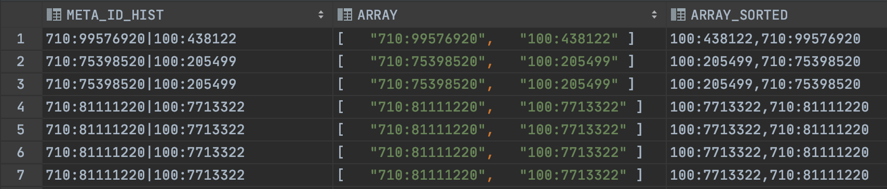
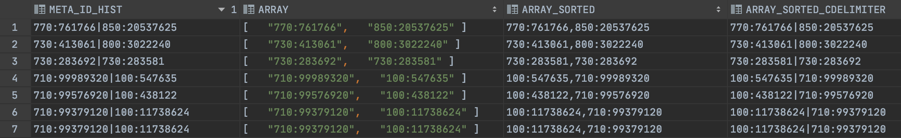

# UDFs (User-Defined Functions)
## General Info
User-defined functions (UDFs) let you extend the system to perform operations that are not available through the built-in, system-defined functions provided by Snowflake.
## Documentation
https://docs.snowflake.com/en/sql-reference/user-defined-functions.html
## UDFs Available
## [array_sort](array_sort.sql)
Function will sort values within an array.
### Example
`Comma Delimited Return`

We use a string value, transform it into a proper array and apply the array_sort() function.
```sql
select META_ID_HIST
     , STRTOK_TO_ARRAY(META_ID_HIST, '|') as array
     , PUBLIC.ARRAY_SORT(STRTOK_TO_ARRAY(META_ID_HIST, '|')) as array_sorted
from test;
```
returns



`Custom Delimited Return`

We use a string value, transform it into a proper array and apply the array_sort() function with '|' as delimiter.
```sql
select META_ID_HIST
     , STRTOK_TO_ARRAY(META_ID_HIST, '|') as array
     , PUBLIC.ARRAY_SORT(STRTOK_TO_ARRAY(META_ID_HIST, '|')) as array_sorted
     , PUBLIC.array_sort(STRTOK_TO_ARRAY(META_ID_HIST, '|'), '|') as array_sorted_cdelimiter
from test;
```
returns

## [convert_us7ascii](convert_us7ascii.sql)
Converts a varchar with special character letters such as ß, ä, ö, é etc. to the best matching normal letters. It can be seen as the alternative for the Oracle SQL function `convert('','us7ascii')` in Snowflake.
### Example
```sql
select PUBLIC.CONVERT_US7ASCII('émíliõ') from dual;
```
returns `emilio`
## [jaro-winkler](jaro-winkler.sql)
Finds the Jaro Wrinker Distance for similarity comparison.
### Example
```sql
select PUBLIC.JaroWrinker('baddurkheim', 'kriegsfeld');
```
return `0.4606060606`